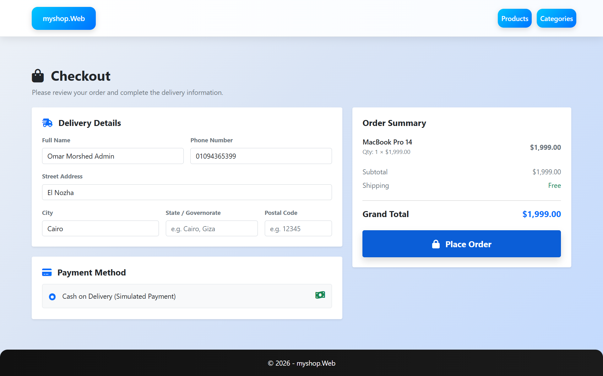

# ShopHub Project

A clean ASP.NET Core MVC startup template designed for students to build E-Commerce projects using the Repository Pattern and Entity Framework Core.

## 🎀 Features

- ASP.NET Core MVC
- Entity Framework Core
- Repository Pattern _(+Generic Repository)_ & Unit Of Work (UoW)
- File Management
- SQL Server Integration
- CRUD Operations
- Identity Authentication & Authorization
- Bootstrap UI
- AdminLTE Dashboard
- DataTables Integration
- Clean Architecture _(Web Application, Data Access, Business Logic)_
- Toastr Notifications
- TempData Notifications
- Session Configuration
- Admin & Customer Separated Views
- Dependency Injection

## 🚀 Technical Highlights & Best Practices

- **Performance Optimization:** Applied `IMemoryCache` to reduce Database hits for frequently accessed data (e.g., Categories).
- **Efficient Data Querying:** Implemented Pagination using `IQueryable` deferred execution (`Skip` and `Take`) to fetch only required records from SQL Server.
- **Decoupled Architecture:** Separation of concerns using Services, ViewModels, and Static Utilities (`FileHelper`).

## 🪶 Included Modules

### Category ✅

- Create Category
- View Categories
- Edit Category
- Delete Category

### Product ✅

- Create Product
- Upload Product Image
- View Products
- Edit Product
- Delete Product

### User Management ✅

- View All Users & Roles

### File Management ✅

- Upload a product image file
- Delete the product image file
- Validate the image size _(> 2MB)_

### Shopping Cart ✅

- Add To Cart
- Increase / Decrease the Product Quantity
- Remove Product
- Clear Cart

## 🏗️ Project Structure

```
BusinessLogic/
    BL/
    DTOs

DataAccess/
    Data/
        ApplicationDbContext.cs
        SeedData.cs
    Migrations/
    Models/
    Repositories/

Entities/
    Models/
    ViewModels/
myshop.Web/
    Areas/
        Admin/
            Controllers/
            Views/
    Controllers/
    Views/
    ViewModels/
    Utilities/
        FileHelper.cs
    wwwroot/
```

## 💻 Technologies

- ASP.NET Core MVC
- Entity Framework Core
- SQL Server
- LINQ
- Bootstrap 5
- AdminLTE 3
- jQuery
- DataTables

## 📊 Database

Update the connection string inside:

```
appsettings.json
```

Then run:

```bash
Update-Database
```

or

```bash
dotnet ef database update
```

<!-- ## Notes

This template is intended as a starting point for educational E-Commerce projects. Students are expected to extend it with additional features such as:

- Shopping Cart
- Orders
- Payments
- Reviews
- Wishlist
- Authentication Enhancements
- Dashboard Analytics -->

<!-- ## License

Educational Use Only. -->

## 🔑 Demo Accounts

To test the application's different roles and functionalities, you will need to use a correct Email Address For the Email Confirmation Message To be able to access the web application !

<!-- | Role                | Email                 | Password              |
| :------------------ | :-------------------- | :-------------------- |
| **Admin**           | OmarAdmin@gmail.com   | OmarAdmin12345#       |
| **Customer / User** | OmarMohamed@yahoo.com | OmarMohamed200512345# | -->

> **Note:** Make sure you have executed the database migrations or database script before attempting to log in with these credentials.

## 📸 Project Screens

<details>
  <summary><b>🛍️ Customer Interface (Click to expand)</b></summary>
  <br>

### Login / Register Screens


### Customer Home Page


### Customer View Product Details


### Edit Review


### Customer Shopping Cart


### My Orders Screen


### Checkout Screen


</details>

<details>
  <summary><b>⚙️ Admin Dashboard (Click to expand)</b></summary>
  <br>

### Products Management


### Categories Management


### User Management


</details>

<details>
  <summary><b>📧 Email Notifications (Click to expand)</b></summary>
  <br>

### Registration Email Confirmation


### Checkout Confirmation Email 


</details>
